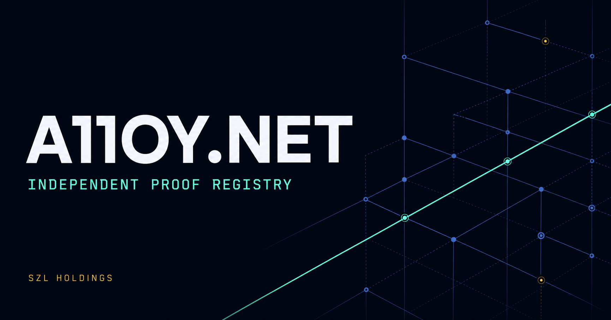

# a11oy Proof Registry

<p align="center">
  
</p>

[`a11oy.net`](https://a11oy.net) is the canonical public proof/registry for
[a11oy](https://a-11-oy.com) (subtitle only: Alloy by SZL Holdings). Domain lock:
this origin is the RECORD. Hub atlas and ROADMAP live here, not on `.com`.
Interactive `/verify` stays on
[a-11-oy.com/verify](https://a-11-oy.com/verify) and is not cloned. There is no `/investor` route;
investor review is [`/diligence/#investors`](https://a11oy.net/diligence/#investors).
This origin remains independently reachable if a-11-oy.com or the Hugging Face
Space is down.

Header on both origins: **Product | Proof**. Product ↗ → `https://a-11-oy.com`.
Proof is the current surface here.

The product experience and the evidence experience are intentionally separate.
Header lockup: **Product | Proof**, linking
[https://a-11-oy.com](https://a-11-oy.com) and
[https://a11oy.net](https://a11oy.net) with those exact words.

A product link proves location and remains `NOT PROBED · UNKNOWN` here. A
schema-valid public Hub runtime stage is only a bounded, point-in-time
`REPORTED` transport observation. Reachability of a URL is `REACHABLE` only,
never quality. Neither proves capability, safety, uptime, or deployed
equivalence.

## Start here

- **Review evidence:** open [a11oy.net](https://a11oy.net).
- **Use the product:** open [a-11-oy.com](https://a-11-oy.com).
- **Read RECORD:** open [a11oy.net/record/](https://a11oy.net/record/).
- **Decision Integrity RECORD:** open [a11oy.net/decision/](https://a11oy.net/decision/). Evaluate on [a-11-oy.com/decision](https://a-11-oy.com/decision) and vanity paths `/terra` `/aegis` `/puriq-markets` `/counsel`. Kernel is not run here. Hub Spaces are not required.
- **Verify a receipt interactively:** use
  [https://a-11-oy.com/verify](https://a-11-oy.com/verify). Do not clone that tool here.
- **Inspect source:** begin with the
  [a11oy repository](https://github.com/szl-holdings/a11oy).
- **Browse public artifacts:** inspect the Hub atlas on this origin, or
  [SZLHOLDINGS on Hugging Face](https://huggingface.co/SZLHOLDINGS).

## Audience routes

- **Evidence registry:** [`/`](https://a11oy.net/) is the RECORD: Hub atlas,
  ROADMAP cards, 90-second diligence table, and browser-observed metadata live here.
- **Investor diligence:** [`/diligence/#summary`](https://a11oy.net/diligence/#summary)
  is the 90-second MEASURED / ROADMAP / UNAVAILABLE table, then thesis, source,
  and boundaries. There is no `/investor` route.
- **RECORD:** [`/record/`](https://a11oy.net/record/) is the canonical receipt
  **index** on this origin — pointers, not a receipt database. This repository
  has no receipt store. Live receipts stay on the product Space (Khipu +
  `/data SZLHOLDINGS/szl-evidence` + `/api/lake/v1/receipts`).
  [`/record.json`](https://a11oy.net/record.json) is the machine contract.
  Interactive verify stays at
  [https://a-11-oy.com/verify](https://a-11-oy.com/verify).
- **Hub atlas:** [`/#atlas`](https://a11oy.net/#atlas) inventories public HF and
  GitHub surfaces. [`/atlas.json`](https://a11oy.net/atlas.json) is fetchable.
- **Dated notes:** [`/notes/`](https://a11oy.net/notes/) and
  [`CHANGELOG.md`](https://a11oy.net/CHANGELOG.md).
- **Developer diligence:** [`/diligence/#developers`](https://a11oy.net/diligence/#developers)
  starts from executable validation and machine-readable contracts.
- **Product handoffs:** [`/chat/`](https://a11oy.net/chat/) and
  [`/code/`](https://a11oy.net/code/) remain live URLs as one-line Diligence
  handoffs, not top-level nav peers. They do not claim product readiness.
  Interactive receipt verify stays on [a-11-oy.com/verify](https://a-11-oy.com/verify).
- **Machine readers:** [`/evidence.json`](https://a11oy.net/evidence.json) states
  the evidence contract, while [`/llms.txt`](https://a11oy.net/llms.txt) routes
  automated readers without extending any claim.
- **Static route scope:** [`/health.json`](https://a11oy.net/health.json) is a
  committed static JSON document. Receiving it proves only that this exact path
  was served. It is not runtime health, not DSSE-LIVE, and not an uptime claim.
  `signer` is `unavailable`: this origin has no DSSE signer and no local key.
  `UNSIGNED-LOCAL` would be wrong here. `sha` is the last published main
  revision; a static file cannot contain its own future commit SHA. ÑAWI
  owns the locked-proven formula count; this document does not.
  [`/readyz/`](https://a11oy.net/readyz/) is an HTML directory route; GitHub
  Pages may 301 `/readyz` to `/readyz/`. That 301 lands on HTML, not JSON. Do
  not treat `/readyz` as a health URL. `/healthz` is not published: GitHub
  Pages returns 404 HTML for that path. That 404 is not a health probe. Do not
  register `/healthz` as a health URL.
  [`/api/build-info/`](https://a11oy.net/api/build-info/) does not publish or
  claim an immutable source revision or product-runtime readiness.

## Architecture

The registry is a dependency-light static site served by GitHub Pages behind
Cloudflare DNS. The committed `CNAME` file is `a11oy.net`. Live DNS for
a11oy.net currently resolves to GitHub Pages, so this proof registry is
independently reachable. Product source (`a11oy_canonical_domain.py`) may
SUNSET-301 `a11oy.net` → `a-11-oy.com` only when that Host header is routed
into the product app. Do not assume this origin is a product host, and do
not add product routes such as `/api/lake` here.

```text
visitor browser
  ├─ static evidence and product links → NOT PROBED · UNKNOWN
  └─ public metadata reads → Hugging Face APIs
       ├─ fail-closed Space-stage policy → bounded REPORTED transport state
       └─ shared admission policy → reported artifact cards
```

No application backend, account, token, model weight, dataset payload, or
private resource is required. The browser reads public Hub listing metadata for
models, datasets, collections, and buckets, plus transport-stage metadata for
two curated public Spaces. Interactive Spaces are not enumerated into generated
registry cards, and Killinchu-named resources remain excluded.

If an upstream read fails, the page preserves the static evidence index and
reports `PARTIAL` or `UNAVAILABLE`; it does not substitute cached capability
claims.

## Evidence contract

| Label | Meaning on this surface |
| --- | --- |
| `MEASURED` | Direct observation with a disclosed source and context. |
| `REPORTED` | Public upstream metadata; not independently measured here. |
| `MODELED` | Simulated or analytically derived. |
| `HEURISTIC` | A bounded rule or score, not a proof. |
| `UNKNOWN` | Evidence is insufficient. |
| `UNAVAILABLE` | The relevant source could not be inspected. |

Operational status is separate from evidence class. Hub `RUNNING` state is
transport metadata and does not establish end-to-end capability.

The kernel chip binds live `/api/a11oy/v1/honest` `locked_formula_count` and
paints **8** only when that field is exactly 8; otherwise **N/A** /
**UNAVAILABLE**. Catalog `LOCKED-PROVEN=25` stays labelled as genome catalog,
not the kernel. Lean-8 ≠ genome-144. Lambda uniqueness remains
**Conjecture 1**, advisory and not a theorem. The trust ceiling is `0.97`,
never 100%.

## Local verification

The repository has no build step. Run the dependency-free contracts from the
repository root:

```bash
python scripts/check_proof_surface.py
python scripts/check_diligence_surface.py
python scripts/check_security_headers.py
python scripts/check_honest_kernel_bind.py
node scripts/check_atlas_policy.mjs
node scripts/check_probe_policy.mjs
node scripts/check_honest_kernel_bind.mjs
```

The checks validate:

- canonical, Open Graph, Twitter, JSON-LD, sitemap, and security discovery;
- local links and social-preview assets;
- keyboard navigation, live-state announcements, and no-script behavior;
- fail-closed atlas admission and honest evidence labels;
- fail-closed Hugging Face runtime-stage classification while product links stay unprobed;
- kernel chips bind `/honest` `locked_formula_count` (8 or N/A / UNAVAILABLE);
- exclusion of interactive Spaces and Killinchu-named resources;
- the investor/developer diligence room, static machine contract, `llms.txt`,
  branded 404, SVG mark, and no-JavaScript route boundaries;
- the committed edge-security contract without promoting it to deployed state.

## Repository map

| Path | Responsibility |
| --- | --- |
| `index.html` | Accessible product narrative, 90-second table, RECORD, live reads, and registry UI. |
| `diligence/index.html`, `assets/diligence.css` | Investor/developer diligence paths, 90-second table, and print-safe presentation. |
| `record/index.html`, `record.json` | Canonical RECORD index of pointers; no receipt store; links to `.com /verify`. |
| `CNAME` | GitHub Pages host is `a11oy.net`. This origin is not a product host. |
| `atlas.json` | Fetchable Hub snapshot + GitHub inventory. |
| `notes/index.html`, `CHANGELOG.md` | Dated notes / status pointers. |
| `evidence.json`, `llms.txt` | Machine-readable evidence boundaries and automated-reader routing. |
| `health.json` | Only health document: committed static JSON; `signer=unavailable`; `sha` is last published main; not runtime, not DSSE-LIVE, not uptime. |
| `readyz/index.html` | HTML directory reachability only; never a health URL. `/healthz` is not published. |
| `api/build-info/index.html` | Static surface scope without an immutable build-identity claim. |
| `chat/index.html`, `code/index.html` | Truthful cross-domain product gateways with no local execution claim. |
| `404.html`, `assets/a11oy-mark.svg` | Branded recovery route and shared SVG identity mark. |
| `site.webmanifest`, `manifest.webmanifest` | Byte-identical application metadata aliases. |
| `scripts/atlas_policy.js` | Shared browser/Node artifact-admission policy. |
| `scripts/check_atlas_policy.mjs` | Executable policy regression contract. |
| `scripts/probe_policy.js` | Shared browser/Node runtime-metadata observation policy. |
| `scripts/check_probe_policy.mjs` | Malformed, transitional, terminal, and `RUNNING` stage regressions. |
| `scripts/honest_kernel_bind.js` | Fail-closed `/honest` `locked_formula_count` kernel-chip bind. |
| `scripts/check_honest_kernel_bind.mjs` | Exact-8 / N/A / UNAVAILABLE regressions for the kernel bind. |
| `scripts/check_honest_kernel_bind.py` | HTML/CSP contract: no hardcoded kernel 8; catalog 25 labelled. |
| `scripts/check_proof_surface.py` | Metadata, accessibility, and truth-surface guard. |
| `scripts/check_diligence_surface.py` | Diligence, machine-contract, no-script, and recovery-route guard. |
| `_headers`, `scripts/check_security_headers.py` | Versioned edge policy and fail-closed static/live validator. |
| `robots.txt`, `sitemap.xml` | Public search discovery. |
| `.well-known/security.txt` | Canonical security-reporting route. |

## Publishing and security

Changes ship through a protected pull request. The exact reviewed head must
pass the link, asset, proof-surface, admission-policy, and doctrine guards
before normal merge.

`_headers` is a versioned edge-security contract, not a live-header receipt. Its
live deployment state remains **UNKNOWN** on this candidate:
`live_edge_security_headers_deployment_proven=false` records only that no proof
has been attached; it is not an observation that deployment is absent. No
source-bound readback URI, UTC
observation time, or source revision is attached. CI recomputes every inline
script hash and rejects a weakened or incomplete contract, but GitHub Pages does not
apply this file. Its presence is therefore not deployment evidence. The domain
must be cut over to a compatible edge host or proxy before those response
headers are live. After cutover, run **Edge Security Readback**; it compares the
root and web-manifest responses with the exact committed contract and fails
closed on missing or changed headers. Update the deployment-state evidence only
after that exact live readback succeeds.

Report vulnerabilities through the organization
[security policy](https://github.com/szl-holdings/.github/security/policy).
Do not include secrets or sensitive evidence in a public issue.

Apache-2.0 licensed. Copyright 2026 SZL Holdings.
