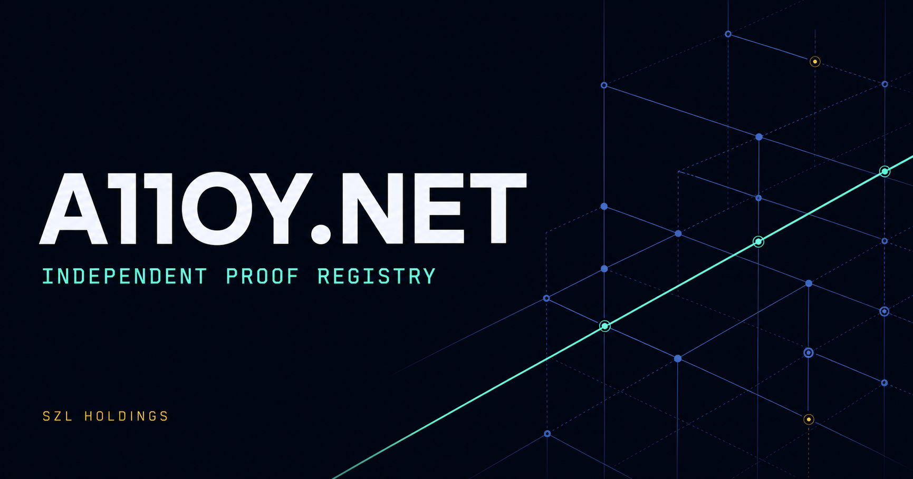

# a11oy Proof Registry
<!-- szl:header v1 -->
<!-- badges: add this repo's CI / release / status badges here -->
[](https://github.com/szl-holdings)
[](https://a-11-oy.com)

**Control before action. Evidence after.**

Part of the [szl-holdings](https://github.com/szl-holdings) estate ·
Product: [a-11-oy.com](https://a-11-oy.com) ·
Proof: [a11oy.net](https://a11oy.net)
<!-- /szl:header -->

<p align="center">
  
</p>

[`a11oy.net`](https://a11oy.net) is the canonical public proof/registry for
[a11oy](https://a-11-oy.com) (subtitle only: Alloy by SZL Holdings). Domain lock:
this origin is the RECORD. Hub atlas and ROADMAP live here, not on `.com`.
Interactive `/verify` stays on
[a-11-oy.com/verify](https://a-11-oy.com/verify) and is not cloned. There is no `/investor` route;
investor review is [`/diligence/#investors`](https://a11oy.net/diligence/#investors).
This origin is a separate failure domain from a-11-oy.com and its Hugging Face
Space; independent reachability requires a fresh host readback.

Header on both origins: **Product | Proof**. Product ↗ → `https://a-11-oy.com`.
Proof is the current surface here.

The product experience and the evidence experience are intentionally separate.
Header lockup: **Product | Proof**, linking
[https://a-11-oy.com](https://a-11-oy.com) and
[https://a11oy.net](https://a11oy.net) with those exact words.

A product link proves location and remains `NOT PROBED · UNKNOWN` here. A
schema-valid public Hub runtime stage is only a bounded, point-in-time
`REPORTED` transport observation. Reachability of a URL is `REACHABLE` only,
never quality. Neither proves capability, safety, uptime, or deployed
equivalence.

## Start here

- **Review evidence:** open [a11oy.net](https://a11oy.net).
- **Use the product:** open [a-11-oy.com](https://a-11-oy.com).
- **Read RECORD:** open [a11oy.net/record/](https://a11oy.net/record/).
- **Decision Integrity RECORD:** open [a11oy.net/decision/](https://a11oy.net/decision/). Evaluate on [a-11-oy.com/decision](https://a-11-oy.com/decision) and vanity paths `/terra` `/aegis` `/puriq-markets` `/counsel`. Kernel is not run here. Hub Spaces are not required.
- **OAC release RECORD:** open [a11oy.net/oac/](https://a11oy.net/oac/) for a dated, synthetic-only source/Hub/CI snapshot. This static page does not probe the current provider or handle patient data.
- **Verify a receipt interactively:** use
  [https://a-11-oy.com/verify](https://a-11-oy.com/verify). Do not clone that tool here.
- **Inspect source:** begin with the
  [a11oy repository](https://github.com/szl-holdings/a11oy).
- **Browse public artifacts:** inspect the Hub atlas on this origin, or
  [SZLHOLDINGS on Hugging Face](https://huggingface.co/SZLHOLDINGS).

## Audience routes

- **Evidence registry:** [`/`](https://a11oy.net/) is the RECORD: Hub atlas,
  ROADMAP cards, 90-second diligence table, and browser-observed metadata live here.
- **Investor diligence:** [`/diligence/#summary`](https://a11oy.net/diligence/#summary)
  is the 90-second SNAPSHOT / MEASURED / ROADMAP / UNAVAILABLE table, then thesis, source,
  and boundaries. There is no `/investor` route.
- **RECORD:** [`/record/`](https://a11oy.net/record/) is the canonical receipt
  **index** on this origin — pointers, not a receipt database. This repository
  has no receipt store. Live receipts stay on the product Space (Khipu +
  `/data SZLHOLDINGS/szl-evidence` + `/api/lake/v1/receipts`).
  [`/record.json`](https://a11oy.net/record.json) is the machine contract.
  Interactive verify stays at
  [https://a-11-oy.com/verify](https://a-11-oy.com/verify).
- **Hub atlas:** [`/#atlas`](https://a11oy.net/#atlas) inventories public HF and
  GitHub surfaces. [`/atlas.json`](https://a11oy.net/atlas.json) is a fetchable
  historical September 25 observation; the newer generated public Hub inventory
  is [`/public-inventory.json`](https://a11oy.net/public-inventory.json).
- **Dated notes:** [`/notes/`](https://a11oy.net/notes/) and
  [`CHANGELOG.md`](https://a11oy.net/CHANGELOG.md).
- **Developer diligence:** [`/diligence/#developers`](https://a11oy.net/diligence/#developers)
  starts from executable validation and machine-readable contracts.
- **Product handoffs:** [`/chat/`](https://a11oy.net/chat/) and
  [`/code/`](https://a11oy.net/code/) remain live URLs as one-line Diligence
  handoffs, not top-level nav peers. They do not claim product readiness.
  Interactive receipt verify stays on [a-11-oy.com/verify](https://a-11-oy.com/verify).
- **Machine readers:** [`/evidence.json`](https://a11oy.net/evidence.json) states
  the evidence contract, while [`/llms.txt`](https://a11oy.net/llms.txt) routes
  automated readers without extending any claim.
- **Static route scope:** [`/health.json`](https://a11oy.net/health.json) is a
  committed static JSON document. Receiving it proves only that this exact path
  was served. It is not runtime health, not DSSE-LIVE, and not an uptime claim.
  `signer` is `unavailable`: this origin has no DSSE signer and no local key.
  `UNSIGNED-LOCAL` would be wrong here. `sha` is the last published main
  revision; a static file cannot contain its own future commit SHA. ÑAWI
  owns the locked-proven formula count; this document does not.
  [`/readyz/`](https://a11oy.net/readyz/) is an HTML directory route; GitHub
  Pages may 301 `/readyz` to `/readyz/`. That 301 lands on HTML, not JSON. Do
  not treat `/readyz` as a health URL. `/healthz` is not published: GitHub
  Pages returns 404 HTML for that path. That 404 is not a health probe. Do not
  register `/healthz` as a health URL.
  [`/api/build-info/`](https://a11oy.net/api/build-info/) does not publish or
  claim an immutable source revision or product-runtime readiness.

## Architecture

The registry is a dependency-light static site configured for GitHub Pages.
The committed `CNAME` file is `a11oy.net`; prior public DNS observations pointed
to GitHub Pages. Recheck current DNS and response bytes before asserting live
reachability. Product source (`a11oy_canonical_domain.py`) may
SUNSET-301 `a11oy.net` → `a-11-oy.com` only when that Host header is routed
into the product app. Do not assume this origin is a product host, and do
not add product routes such as `/api/lake` here.

```text
visitor browser
  ├─ static evidence and product links → NOT PROBED · UNKNOWN
  └─ public metadata reads → Hugging Face APIs
       ├─ fail-closed Space-stage policy → bounded REPORTED transport state
       └─ shared admission policy → reported artifact cards
```

No application backend, account, token, model weight, dataset payload, or
private resource is required. The browser reads public Hub listing metadata for
models, datasets, collections, and buckets, plus transport-stage metadata for
two curated public Spaces. Interactive Spaces are not enumerated into generated
registry cards, and Killinchu-named resources remain excluded.

If an upstream read fails, the page preserves the static evidence index and
reports `PARTIAL` or `UNAVAILABLE`; it does not substitute cached capability
claims.

## Evidence contract

| Label | Meaning on this surface |
| --- | --- |
| `SNAPSHOT` | A dated historical observation or catalog copy; not a live readback or current state. |
| `MEASURED` | Direct observation with a disclosed source and context. |
| `REPORTED` | Public upstream metadata; not independently measured here. |
| `MODELED` | Simulated or analytically derived. |
| `HEURISTIC` | A bounded rule or score, not a proof. |
| `UNKNOWN` | Evidence is insufficient. |
| `UNAVAILABLE` | The relevant source could not be inspected. |

Operational status is separate from evidence class. Hub `RUNNING` state is
transport metadata and does not establish end-to-end capability.

Nine machine contracts are checked by `scripts/check_evidence_bindings.py`:
`/evidence.json`, `/atlas.json`, `/estate.json`, `/origin.json`,
`/estate/hf-current.json`, `/models.json`, `/spaces.json`, and both dated PyPI
provenance records. A `MEASURED` claim in any of them needs a same-object
`evidence_uri` and SHA-256 `evidence_digest` resolving to exact published
witness bytes. Their unwitnessed observations remain `SNAPSHOT`, while carried
benchmark assertions remain `REPORTED`. This is not a whole-registry
certification: raw Hub/PyPI response witnesses and a site-wide census still
need separate review. `/evidence.json` keeps those exceptions explicit.
`/spaces.json` v2 replaces the unsupported historical `cut.measured` name
with `cut.snapshot_total`; clients using that field must update explicitly.
The dated `/stalled.json` record still names v1.2.0 at a mutable URL; it is
preserved unchanged, and the referenced older source is pinned at
[`2ee4a7f:spaces.json`](https://github.com/szl-holdings/a11oy-net/blob/2ee4a7fe44085c43e61e7e665e304555b415d1f4/spaces.json).

The kernel chip binds live `/api/a11oy/v1/honest` `locked_formula_count` and
paints **8** only when that field is exactly 8; otherwise **N/A** /
**UNAVAILABLE**. Catalog `LOCKED-PROVEN=25` stays labelled as genome catalog,
not the kernel. Lean-8 ≠ genome-144. Lambda uniqueness remains
**Conjecture 1**, advisory and not a theorem. The trust ceiling is `0.97`,
never 100%.

## Local verification

The repository has no build step. Run the dependency-free contracts from the
repository root:

```bash
python scripts/check_proof_surface.py
python scripts/check_evidence_bindings.py
python scripts/check_diligence_surface.py
python scripts/check_security_headers.py
python scripts/check_honest_kernel_bind.py
node scripts/check_atlas_policy.mjs
node scripts/check_probe_policy.mjs
node scripts/check_honest_kernel_bind.mjs
python -m unittest tests.test_evidence_bindings tests.test_generate_hf_inventory
```

The checks validate:

- canonical, Open Graph, Twitter, JSON-LD, sitemap, and security discovery;
- local links and social-preview assets;
- keyboard navigation, live-state announcements, and no-script behavior;
- fail-closed atlas admission and honest evidence labels;
- fail-closed Hugging Face runtime-stage classification while product links stay unprobed;
- kernel chips bind `/honest` `locked_formula_count` (8 or N/A / UNAVAILABLE);
- exclusion of interactive Spaces and Killinchu-named resources;
- the investor/developer diligence room, static machine contract, `llms.txt`,
  branded 404, SVG mark, and no-JavaScript route boundaries;
- the committed edge-security contract without promoting it to deployed state.

## Repository map

| Path | Responsibility |
| --- | --- |
| `index.html` | Accessible product narrative, 90-second table, RECORD, live reads, and registry UI. |
| `diligence/index.html`, `assets/diligence.css` | Investor/developer diligence paths, 90-second table, and print-safe presentation. |
| `record/index.html`, `record.json` | Canonical RECORD index of pointers; no receipt store; links to `.com /verify`. |
| `oac/index.html`, `oac/release.json` | Dated OAC synthetic release record; no scoring runtime, live probe, or clinical result path. |
| `CNAME` | GitHub Pages host is `a11oy.net`. This origin is not a product host. |
| `atlas.json` | Fetchable Hub snapshot + GitHub inventory. |
| `scripts/generate_hf_inventory.py`, `.github/workflows/hf-inventory-refresh.yml` | The only writer of Hub counts here: regenerates current inventory and page fields from the unauthenticated Hub API after matching all model, dataset, and Space IDs to an immutable signed A11oy manifest; the workflow reruns it daily and proposes a reviewed PR whose commit GitHub signs (`scripts/verified_commit_payload.py`). No Hugging Face token. |
| `public-membership.json`, `estate/canonical-hf-manifest.json` | Current public repository membership and exact retained canonical source bytes. The record binds the GitHub source revision, Git blob, SHA-256, scope, and counts. A source movement during observation, visibility ambiguity, or membership drift blocks generation. |
| `public-membership.observed-2026-09-10.json` | Exact September 10 membership receipt retained as history; its observation, source, counts, and evidence are not relabelled. |

Public repository membership consists of models, datasets, and Spaces, including
the reserved public `README` Space when it is independently observable. Kernel
repositories are a subset of models and are counted once in totals. Collections
and buckets are separately observed auxiliary resources outside that membership
scope. Neither listing alignment nor source binding establishes runtime readiness,
model quality, or permission to publish a product release.
| `notes/index.html`, `CHANGELOG.md` | Dated notes / status pointers. |
| `evidence.json`, `llms.txt` | Machine-readable evidence boundaries and automated-reader routing. |
| `health.json` | Only health document: committed static JSON; `signer=unavailable`; `sha` is last published main; not runtime, not DSSE-LIVE, not uptime. |
| `readyz/index.html` | HTML directory reachability only; never a health URL. `/healthz` is not published. |
| `api/build-info/index.html` | Static surface scope without an immutable build-identity claim. |
| `chat/index.html`, `code/index.html` | Truthful cross-domain product gateways with no local execution claim. |
| `404.html`, `assets/a11oy-mark.svg` | Branded recovery route and shared SVG identity mark. |
| `site.webmanifest`, `manifest.webmanifest` | Byte-identical application metadata aliases. |
| `scripts/atlas_policy.js` | Shared browser/Node artifact-admission policy. |
| `scripts/check_atlas_policy.mjs` | Executable policy regression contract. |
| `scripts/probe_policy.js` | Shared browser/Node runtime-metadata observation policy. |
| `scripts/check_probe_policy.mjs` | Malformed, transitional, terminal, and `RUNNING` stage regressions. |
| `scripts/honest_kernel_bind.js` | Fail-closed `/honest` `locked_formula_count` kernel-chip bind. |
| `scripts/check_honest_kernel_bind.mjs` | Exact-8 / N/A / UNAVAILABLE regressions for the kernel bind. |
| `scripts/check_honest_kernel_bind.py` | HTML/CSP contract: no hardcoded kernel 8; catalog 25 labelled. |
| `scripts/check_proof_surface.py` | Metadata, accessibility, and truth-surface guard. |
| `scripts/check_diligence_surface.py` | Diligence, machine-contract, no-script, and recovery-route guard. |
| `_headers`, `scripts/check_security_headers.py` | Versioned edge policy and fail-closed static/live validator. |
| `robots.txt`, `sitemap.xml` | Public search discovery. |
| `.well-known/security.txt` | Canonical security-reporting route. |

## Publishing and security

Changes ship through a protected pull request. The exact reviewed head must
pass the link, asset, proof-surface, admission-policy, and doctrine guards
before normal merge.

### GitHub Pages exact-source deployment

The repository carries a pinned GitHub Actions Pages pipeline in
`.github/workflows/link-check.yml`. The protected PR context named
`pages build and deployment` remains a candidate-only build: it never deploys
a pull request. It copies only files tracked by the exact checked-out commit
into an isolated staging directory, excludes `.git` and `.github`, and stamps
`health.json` only in that staging copy. The committed source file is not
rewritten. The artifact preserves `.nojekyll` and `.well-known/security.txt`.

The Pages provider was observed as `build_type=workflow` on 2026-10-03 UTC. A
main-branch push builds and deploys automatically; an operator may also
explicitly dispatch the workflow from `main` with `deploy=true`. Both paths
check out `github.sha`, prove the local checkout is that exact revision, and
re-read protected `main` immediately before deployment. If `main` moved,
deployment fails closed rather than publishing a stale artifact. The
[October 3 main run](https://github.com/szl-holdings/a11oy-net/actions/runs/37080908308)
completed successfully for `68ec09e303d215eebdc5c6268519406820025f9d`;
a cache-busted public
`/health.json` read returned that SHA with `signer=unavailable` and
`uptime=NOT_MEASURED`. That dated result is not a promise about later revisions.

The pipeline uses immutable action revisions, keeps source build permissions
separate from deployment permissions, and grants `pages: write` plus
`id-token: write` only to the deploy job. The deployment establishes an exact
static-source binding only. It does not prove runtime health, signing, uptime,
or live response headers.

During the 2026-10-02/03 UTC readbacks, public HTTPS through Cloudflare and a
direct TLS read of the GitHub Pages origin both worked, but the Pages API reported
`https_certificate.state=bad_authz` and `https_enforced=false`. The observed
origin certificate expires on 2026-10-14. This is an origin-renewal risk, not
evidence of a public outage. Inspect the Cloudflare SSL mode and underlying
proxied DNS targets with provider access, diagnose Pages ACME authorization,
then require a renewed `approved` origin certificate and read back both origin
and edge HTTPS before closing that risk. A Cloudflare edge response alone
does not establish end-to-end TLS.

Post-merge verification sequence:

1. Confirm the merged revision is the current protected `main` head and both
   required PR contexts passed for that exact reviewed head.
2. Re-read the Pages provider setting and require `build_type=workflow` for an
   Actions deployment. Investigate any changed setting before publication.
3. Confirm the merge-triggered **Link & Asset Check** build and deploy jobs
   succeeded for that protected-main revision. If a separate dispatch is
   needed, use `main` with `deploy=true`; a moved `main` is refused at final
   reauthorization.
4. Retain the successful workflow URL and deployed `page_url`, then read back
   `/health.json` and require its `sha` to equal the deployed protected-main
   revision. Preserve `signer=unavailable`, `probe_contract=STATIC_DOCUMENT`,
   `uptime=NOT_MEASURED`, and `dsse_live=NOT_CLAIMED`.

Rollback is reviewable: revert a bad source revision through a normal
protected pull request, then verify the resulting Pages deployment and public
files against that known revision. A provider-setting change needs its own
current-state review; do not assume the earlier branch-deployment mode is
still configured. Do not hand-edit the committed `health.json` to impersonate
a deployment, and do not treat rollback reachability as runtime-health or
header-deployment evidence.

`_headers` is a versioned edge-security contract, not a live-header receipt. Its
live deployment state remains **UNKNOWN** on this candidate:
`live_edge_security_headers_deployment_proven=false` records only that no proof
has been attached; it is not an observation that deployment is absent. No
source-bound readback URI, UTC
observation time, or source revision is attached. CI recomputes every inline
script hash and rejects a weakened or incomplete contract, but GitHub Pages does not
apply this file. Its presence is therefore not deployment evidence. The domain
must be cut over to a compatible edge host or proxy before those response
headers are live. After cutover, run **Edge Security Readback**; it compares the
root and web-manifest responses with the exact committed contract and fails
closed on missing or changed headers. Update the deployment-state evidence only
after that exact live readback succeeds.

Report vulnerabilities through the organization
[security policy](https://github.com/szl-holdings/.github/security/policy).
Do not include secrets or sensitive evidence in a public issue.

Apache-2.0 licensed. Copyright 2026 SZL Holdings.


<!-- AEGIS-KILLINCHU-CONSOLIDATION:v1 -->
## Aegis → Killinchu consolidation

`/aegis/` remains a static historical proof route. Aegis is not a separate current product authority: it is an assurance and portfolio capability plane inside [Killinchu](https://huggingface.co/spaces/SZLHOLDINGS/killinchu). Sentra / Defend, IMMUNE, Vessels / Maritime, and Counter-UAS / Airspace are internal capability planes. Runtime readiness is never inferred from this repository or from URL reachability.
